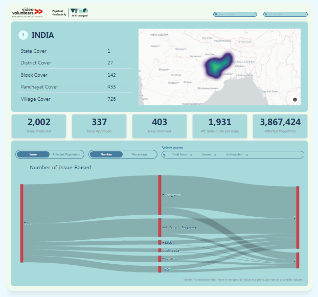
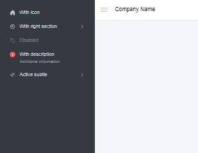
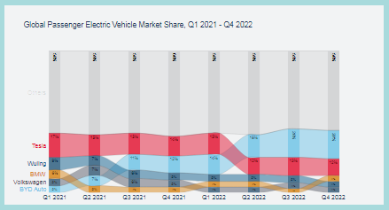
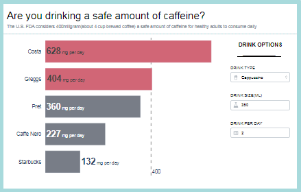

# Multi Pages Dash App

## Table of contents
* [Introduction](#introduction)
* [Pages](#pages)

## Introduction

Dash Pages is an advanced feature introduced in Dash version 2.5.0, specifically designed to streamline the development of multi-page applications. With Dash Pages, one can effortlessly handle URL routing and effectively structure their applications by defining different pages. This feature offers a simplified approach to creating dynamic and interactive web applications with Dash. 

In this repository, Dash Pages has been utilized to develop a multi-page application

## Pages

* Dashboard for VizforSocialGood - Video Volunteer

 

Project [link](https://www.vizforsocialgood.com/join-a-project/2023/2/4/video-volunteers-india)
Dashboard [link](https://dashboardit.onrender.com/VideoVolunteers)
One of the key areas focused is automating the generation of Sankey charts. Sankey charts are powerful visualizations that help depict flows and relationships between different variables.

* Responsive Navbar

Medium Blog [link](https://abhinavk910.medium.com/building-dashboard-using-dash-responsive-navbar-part-1-455c68eb04ae)
Navbar [link](https://dashboardit.onrender.com/ResponsiveNavbarJS)
Building Responsive Navbar in dash using dash mantine component.

* Makeover Monday

Week 7, 2023 [link](https://dashboardit.onrender.com/mm_2023_w7)

Week 9, 2023 [link](https://dashboardit.onrender.com/mm_2023_w9)

Week 10, 2023 [link](https://dashboardit.onrender.com/mm_2023_w10)
